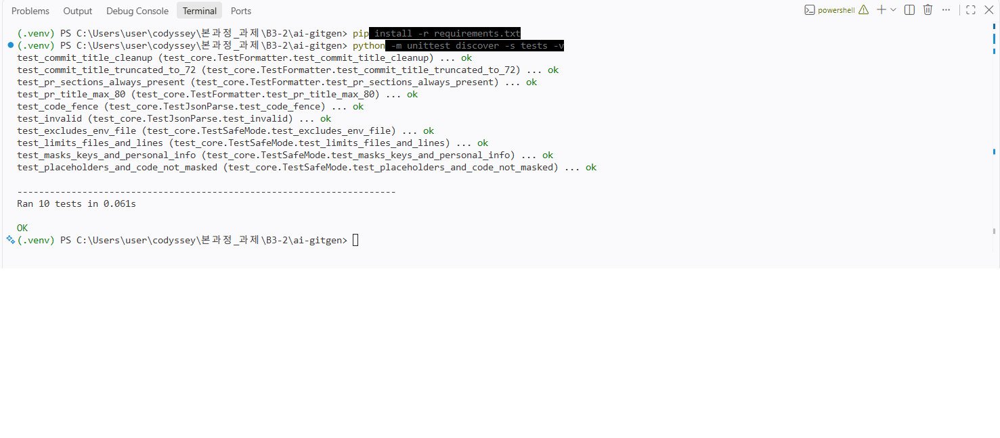
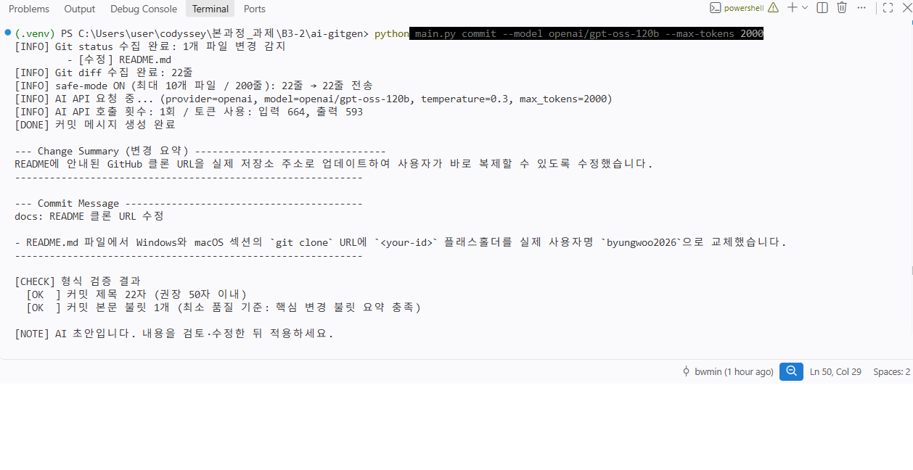
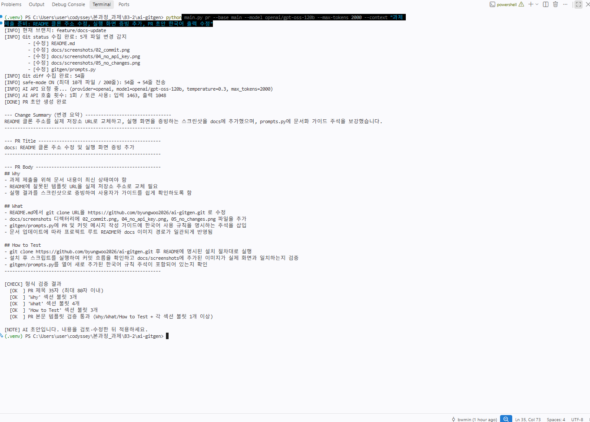
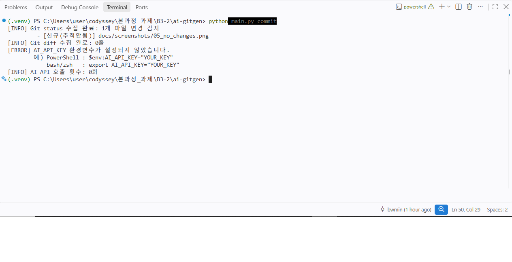
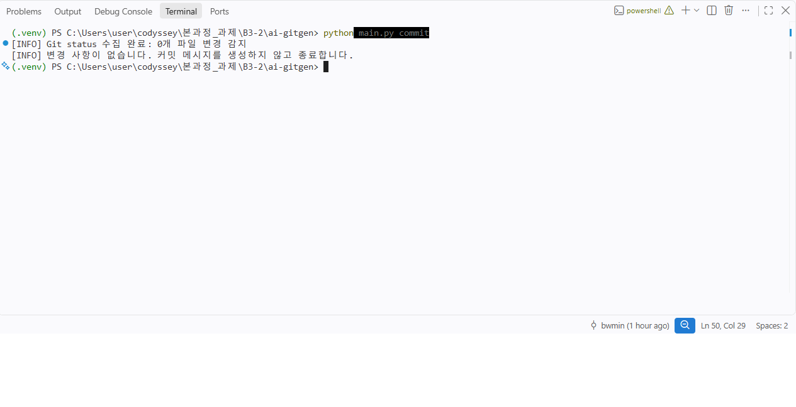
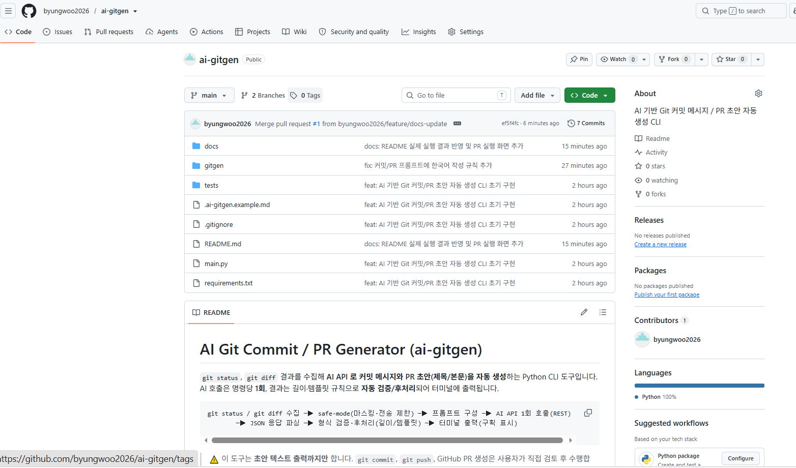
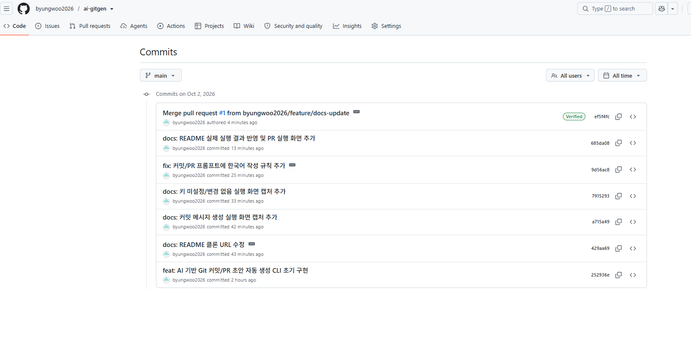
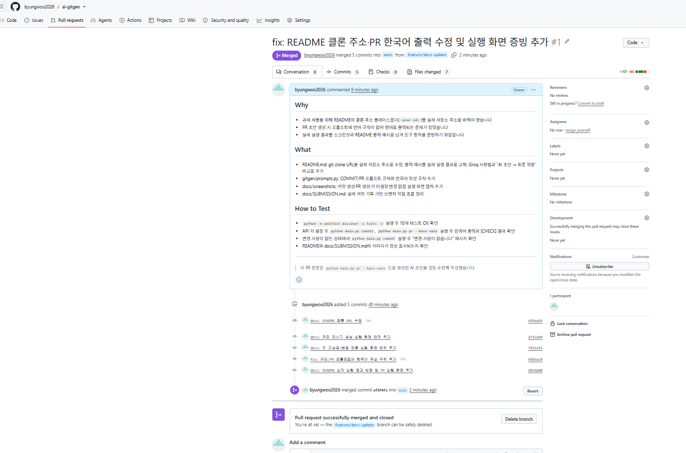

# 과제 제출 증빙 (결과물 체크리스트)

> 각 결과물이 어디에서 확인되는지 정리한 문서입니다. 스크린샷은 `docs/screenshots/` 폴더에 있습니다.

## 결과물 1. AI API 연동 및 자동화 흐름 동작 확인

| 확인 항목 | 증빙 |
|---|---|
| 단위 테스트 통과 (마스킹·길이 검증·템플릿 검증) |  |
| `python main.py commit` → status/diff 수집 → AI 1회 호출 → 변경 요약 + 커밋 메시지 출력 |  |
| `python main.py pr --base main` → 변경 요약 + PR 제목/본문(Why/What/How to Test) 출력 |  |
| API Key 미설정 시 오류 안내 (호출 0회) |  |
| 변경 사항이 없을 때 안내 후 종료 |  |

## 결과물 2. GitHub 리포지토리

| 확인 항목 | 증빙 |
|---|---|
| 소스 코드 / 파일 구조 업로드 |  |
| 커밋 히스토리 |  |
| 브랜치 작업 흐름 (feature 브랜치 → PR → main 병합) |  |

브랜치 작업 흐름 (실제 커밋 기록)

```
main ──● 252936e feat: AI 기반 Git 커밋/PR 초안 자동 생성 CLI 초기 구현 ─────────────● (PR 병합)
        \                                                                         /
         feature/docs-update
           ● 429aa69 docs: README 클론 URL 수정                ← 도구가 생성한 메시지 그대로 커밋
           ● a715a49 docs: 커밋 메시지 생성 실행 화면 캡처 추가
           ● ...     docs: 키 미설정/변경 없음 실행 화면 캡처 추가
           ● ...     fix: 커밋/PR 프롬프트에 한국어 작성 규칙 추가   ← 도구 초안(docs:)을 검토 후 fix: 로 수정
           ● ...     docs: README 실제 실행 결과 반영 및 PR 실행 화면 추가
```

- 각 커밋 메시지는 `python main.py commit` 으로 생성한 초안을 검토해 적용했고, PR 본문은 `python main.py pr --base main` 초안을 다듬어 GitHub 에서 직접 작성했습니다 (도구는 원격 반영을 하지 않음 — 과제 제약 준수).
- AI 초안 → 최종 변경점은 [README 5장 "AI 초안 → 최종 적용 시 다듬은 점"](../README.md) 참고.

## 결과물 3. 사용 가이드 문서

- 리포지토리 최상위 [`README.md`](../README.md)
- 포함 항목: 설치 방법 · 환경변수(API Key) 설정 · 커밋/PR 명령 예시 · 출력 예시 · safe-mode(민감정보) · 비용/요청 횟수 안내

## 과제 요구사항 대응표

| 요구사항 | 구현 위치 |
|---|---|
| git status / git diff 수집, 루트 디렉토리 확인 | `gitgen/git_collector.py` |
| 변경 사항 없음 처리 | `main.py` |
| API Key 환경변수(하드코딩 금지) | `gitgen/ai_client.py` `get_api_key()` |
| 네트워크/인증 실패 시 원인 출력 | `gitgen/ai_client.py` `call_ai()` |
| `--model` `--temperature` `--max-tokens` 옵션 + 기본값 | `main.py` `build_parser()` |
| 커밋 제목 50/72자, PR 제목 80자, PR 섹션·불릿 검증 (후처리 방식) | `gitgen/formatter.py` |
| 구분선/헤더로 구획된 출력 | `main.py` `section()` |
| 명령당 AI 호출 1회 + 호출 횟수 로그 | `main.py` |
| safe-mode (A) 마스킹 + (B) 최대 10개 파일 / 200줄 | `gitgen/safe_mode.py` |
| (보너스) 팀 컨벤션 파일 `.ai-gitgen.md` | `main.py` `load_convention()` |
